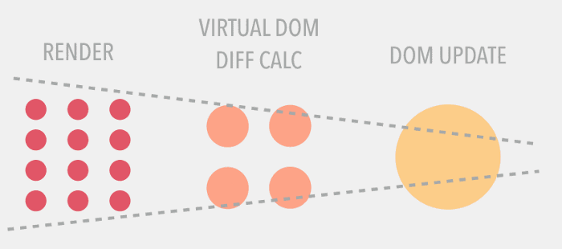

# React Entrevista Questões & Respostas

Se você gostou desse projeto, faça um Pull Request será de muita ajuda :].

### Table of Contents

| No. | Questões |
| --- | --------- |
|   | **Core React** |
|1  | [O que é React?](#o-que-é-react) |
|2  | [Quais são os principais recursos do React?](#quais-são-os-principais-recursos-do-react) |
|3  | [O que é JSX?](#o-que-é-jsx) |
|4  | [Qual a diferença entre um Elemento e um Component?](#qual-a-diferença-entre-um-elemento-e-um-component) |
|5  | [Como criar um component em React?](#como-criar-um-component-em-react) |
|6  | [Quando usar um component de classe e um component de função?](#quando-usar-um-componente-de-classe-e-um-component-de-função) |
|7  | [ O que são components puros?](#o-que-são-components-puros) |
|8  | [Qual a diferença entre um component e um PureComponent?](#qual-a-diferença-entre-um-component-e-um-purecomponent) |
|9 | [Quando usar um PureComponent?](#quando-usar-um-purecomponent) |

## Core React

1. ### O que é React?

    React é uma **biblioteca frontend JavaScript open-source** que é usada para construir ui especialmente para SPA(single page applications). É usada para manipulação da camada de visualização para web e aplicativos mobiles. React foi criado por Jordan Walke, um software engineer trabalhando para o Facebook. O  React foi implementado pela primeira vez no Feed do Facebook's em 2011 e no Instagram em 2012.
    
2. ### Quais são os principais recursos do React?
    
    Os principais recursos do react são:
    
    * Usa o **VirtualDOM** em vez de RealDOM, considerando as manipulações do RealDOM caras.
    * Suporte **server-side rendering**.
    * Seguidores **Unidirecional** fluxo de dados ou data binding.
    * Usa **reusable/composable** UI de componentes para desenvolvimento da view.
    
3. ### O que é JSX?

    ```jsx harmony
    const element = <h1>Hello, world!</h1>;
    ```

    Esta sintaxe estranha de tags não é uma string, nem HTML, é chamada *JSX* uma extensão de sintaxe do ECMAScript (o acrônimo significa *JavaScript XML*). Basicamente ele nós da expressividade de JavaScript junto com o HTML como sintaxe de template. O exemplo abaixo pode lembrar uma linguagem de template, mas vem com todo o poder do JavaScript. Lembrando que o JSX não é obrigatório para utilizar o React.
    
    Neste exemplo o texto dentro da tag `<h1>` retorna como uma função Javascript para a função render.
    
    ```jsx harmony
    class App extends React.Component {
      render() {
        return(
          <div>
            <h1>{'Bem vindo ao mundo reativo!!'}</h1>
          </div>
        )
      }
    }
    ```

4. ### Qual a diferença entre um Elemento e um Component?
    Um *Elemento* é um objeto simples que descreve o que você quer que apareça na tela. Um elemento pode conter outros elementos, criar um elemento é barato. Uma vez que o elemento é criado, ele nunca é alterado.
    
    A representação de um React Element objeto seria a seguinte: 
    
    ```javascript
    const element = React.createElement(
    'div',
    {id: 'login-btn'},
    'Login'
    )
    ```
    O exemplo acima a função `React.createElement()` retorna um objeto: 
    
    ```
    {
        type: 'div',
        props: {
            children: 'Login',
            id: 'login-btn'
        }
    }
    ```
    
    E finalmente para renderizar no DOM usa `ReactDOM.render()`:
    
    ```html
    <div id='login-btn'>Login</div>
    ```
    
    Enquanto um **componente** pode ser declarado de várias maneiras diferentes. Pode ser uma classe com um método `render()`. Outra alternativa, em um simples caso, você pode definir uma função. Em qualquer um dos casos, ele usa props como entrada e retorna um JSX como saída:
    
     ```javascript
    const Button = ({ onLogin }) =>
      <div id={'login-btn'} onClick={onLogin}>Login</div>
    ```
    
    Então o JSX transpila a função `React.createElement()` a saída:
    
    ```javascript
    const Button = ({ onLogin }) => React.createElement(
      'div',
      { id: 'login-btn', onClick: onLogin },
      'Login'
    )
    ```
    
5. ### Como criar um component em React?

    Existe duas maneiras possíveis para criar um component.
    
    1. **Function Components:** Isto é um jeito simples de criar um component. Essas são funções puras de JavaScript ela aceita props objetos como seu primeiro parâmetro e retorna React elementos:
    
        ```jsx harmony
        function Greeting({ message }) {
            return <h1>{`Olá, ${message}`}</h1>
        }
        ```
    2. **Class Components:** Além disso você pode usar classes do ES6 para definir seu component. Uma função component pode ser escrita assim:
     
        ```jsx harmony
        class Greeting extends React.Component {
           render() {
             return <h1>{`Olá, ${this.props.message}`}</h1>
           }
        }
        ```

6. ### Quando usar um component de classe e um component de função?

    Se o seu component precisar de um estado ou de um ciclo de vida então use component classe, de outra forma use a component função.

7. ### O que são components puros?

     É uma das maneiras mais significativas de otimizar os aplicativos React. O uso de pure component fornece um aumento considerável no desemepnho pois reduz o número de operações de renderização no aplicativo. *`React.PureComponent`* é exatamente o mesmo de *`React.Component` exceto pelo fato de lidar com o `shouldComponentUpdate()` para você. Nós devemos sempre tentar fazer o nosso estado o mais simples póssivel e minimizar o número de estado do component.

8. ### Qual a diferença entre um component e um PureComponent?
      A principal diferença entre um Component e um PureComponent é que o PureComponent modifica a forma em que o diff é feito no processo de renderização, basicamente, a verificação de dados pro update do componente é feita no modo shallow.

      

      Isto significa que: Em uma comparação de não-objetos (array, primitive, type, etc) o conteúdo é que é utilizado como item para comparação enquanto que, quando você compara objetos, apenas a referência é verificada.

      Principalmente por conta dessa shallow comparison é o que uso de PureComponent pode incrementar a perfomance da sua aplicação na renderização de components.

9. ### Quando usar um PureComponent?
      1. State/Props devem ser imutáveis
      2. State/Props não devem ter uma hierarquia
      3. Você deve controlar quando o dado muda através de umforceUpdate()
         ou dispatch de actions
      4. Os filhos desse component devem ser puros